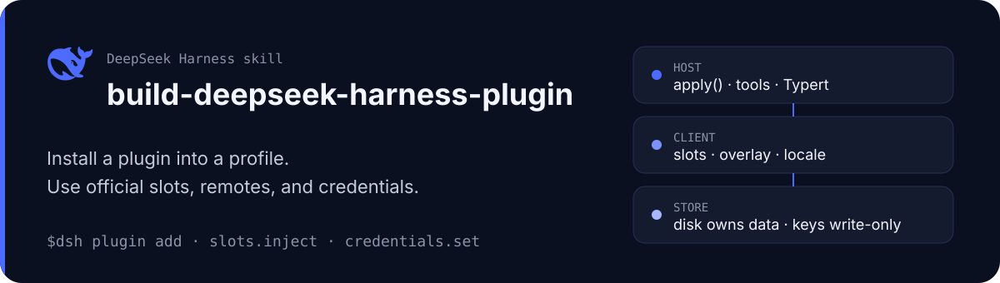

<p align="center">
  
</p>

<p align="center">
  <a href="./README.md">English</a> | 中文
</p>

<p align="center">
  <a href="./LICENSE"></a>
  
</p>

# build-deepseek-harness-plugin

给 Agent 用的 skill，面向**已安装**的 DeepSeek Harness 插件。它说明怎么装配 TypeScript 组合包、选公开 Slot、挂 Typert Remote、把密钥放进官方凭据，以及怎么证明插件真的加载了。

官方入门教程仍是第一英里的依据。这份补的是真正发出去一个组合包之后才会碰到的重载、布局和凭据规则。

先读这些官方页面：

- [第一个插件](https://github.com/deepseek-ai/deepseek-harness/blob/master/docs/user/develop/basic/index.zh.md)
- [开发一个工具](https://github.com/deepseek-ai/deepseek-harness/blob/master/docs/user/develop/basic/tool.zh.md)
- [打包与安装](https://github.com/deepseek-ai/deepseek-harness/blob/master/docs/user/develop/basic/publish.zh.md)
- [Credentials](https://github.com/deepseek-ai/deepseek-harness/blob/master/docs/subsystems/credentials.zh.md)
- [API Gateway](https://github.com/deepseek-ai/deepseek-harness/blob/master/docs/api-gateway.zh.md)

鲸鱼标志来自 [Harness 网站资源](https://github.com/deepseek-ai/deepseek-harness/blob/master/website/public/favicon.svg) 里的官方 logo。

## 用来做什么

- 编写或调试用 `dsh plugin add` 装进 profile 的插件
- Client Slot（`settings.plugin.item`、`shell.overlay`、sidebar 子槽位）
- Typert Remote、`credentials.set`，以及「改了 schema 界面还是旧的」
- 替换官方插件且不借用它的 Cordis ID

不要用在会话内 `cordis_define` 包、浏览器扩展，或 `deepseek-ai/deepseek-harness` 仓库内部的 PR。

## 安装这个 skill

可以把 `https://github.com/oil-oil/build-deepseek-harness-plugin` 交给 Agent 安装，或使用 skills CLI：

```sh
npx skills add https://github.com/oil-oil/build-deepseek-harness-plugin
```

Claude Code / Codex：

```sh
git clone https://github.com/oil-oil/build-deepseek-harness-plugin.git
ln -s "$(pwd)/build-deepseek-harness-plugin" ~/.claude/skills/build-deepseek-harness-plugin
ln -s "$(pwd)/build-deepseek-harness-plugin" ~/.codex/skills/build-deepseek-harness-plugin
```

下一轮插件任务点名 `$build-deepseek-harness-plugin`。

## 使用：Agent 怎么开始

1. 确认任务是可安装组合包，不是动态 Cordis 包。
2. 按任务去读 [docs/user/develop](https://github.com/deepseek-ai/deepseek-harness/tree/master/docs/user/develop) 对应教程。
3. 只打开当前需要的 reference：

| 任务 | 读 |
| --- | --- |
| 官方契约 vs 项目约定 | [references/official-practices.md](./references/official-practices.md) |
| 版本破坏点与启动器覆盖层 | [references/version-and-integration-boundaries.md](./references/version-and-integration-boundaries.md) |
| 包、patch、五层依赖 | [references/package-and-build.md](./references/package-and-build.md) |
| Slot、主题、官方控件 | [references/client-slots-and-theme.md](./references/client-slots-and-theme.md) |
| Settings、Remote、凭据、发布 | [references/persistence-and-release.md](./references/persistence-and-release.md) |

4. 契约变更后：重建、重启 profile 进程、硬刷新浏览器。

检查一个插件目录：

```sh
node scripts/check_plugin.mjs /path/to/plugin
```

## 配置

本 Skill 不需要 API Key 或服务账号。版本敏感任务应提供目标 Harness commit、CLI 版本、profile，以及 launcher 或 Desktop 的版本/模式。引用检查器支持 `--harness <checkout> --harness-ref <commit>`。

## 兼容性、数据与权限边界

- 当前维护基线是 DeepSeek Harness `0.1.1-rc.2`，不代表无条件兼容。Slot、Settings 暴露、Client 模块边和 Remote 挂载都要对照目标 commit。
- 独立 GitHub 包不会因为 Host 声明了 `@Remote` 就自动出现在 `ctx.remote`。
- Skill 会读取插件和 Harness 源码、运行本地构建/检查命令，只修改或发布用户明确放入范围的仓库；不需要凭据，也不会把项目数据发送到外部服务。
- 这是社区笔记。与官方文档冲突时以官方为准。

## License

[MIT](./LICENSE)

---

社区笔记，与 DeepSeek 无关，也未经其背书。
